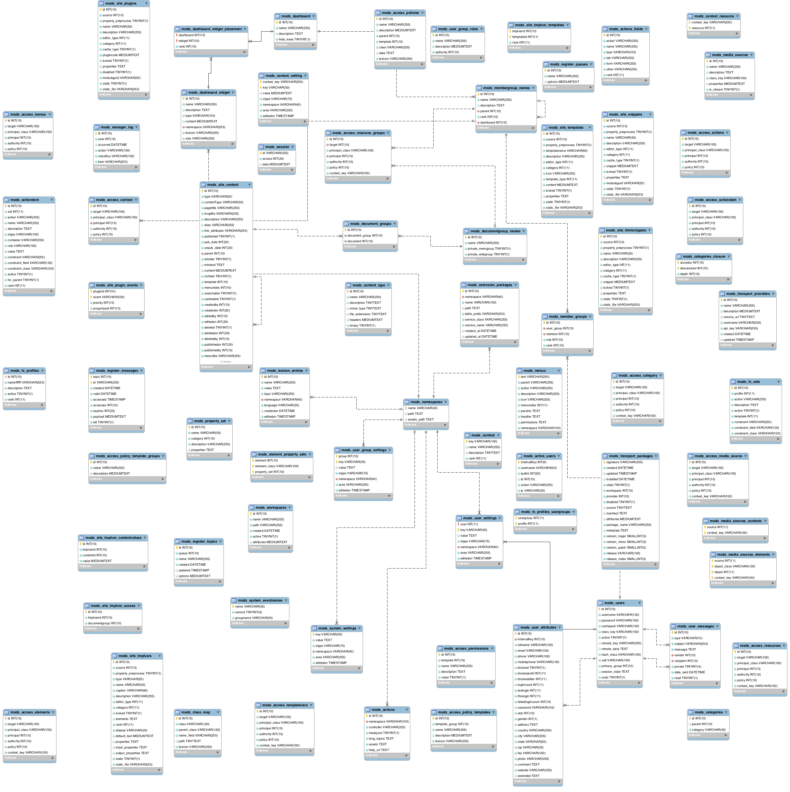

# Foreign keys in the MODX schema

The goal of this project is to _visualise_ schema relations in MODX. After a fruitless afternoon trying to navigate from one side of the ACL to another, I decided it was time to do this.

## Outcomes

1. A nice visual diagram showing the relations between models
2. A SQL schema using InnoDB tables with foreign keys (and using `ON DELETE NO ACTION` so no unexpected side effects from cascades)

## Current progress:

## How you can contribute
The work is being done using the free [MySQL Workbench](http://dev.mysql.com/downloads/workbench/). To contribute, [download](http://dev.mysql.com/downloads/workbench/) and install it, open `modx_schema.mwb` in Workbench and make your edits.

Unfortunately MySQL Workbench uses a binary format, so unless you're going to be quick, please make your edits **WITHOUT** moving the location of any tables, as this changes more of the underlying file format.

Save often, as Workbench has a habit of crashing. When you're done, export a new `progress.png` and create a pull request. I'll replace/attempt to merge the changes into this repository's schema file.

The MODX schema XML file is included for your convenience, so you can refer to it for relationship information.
